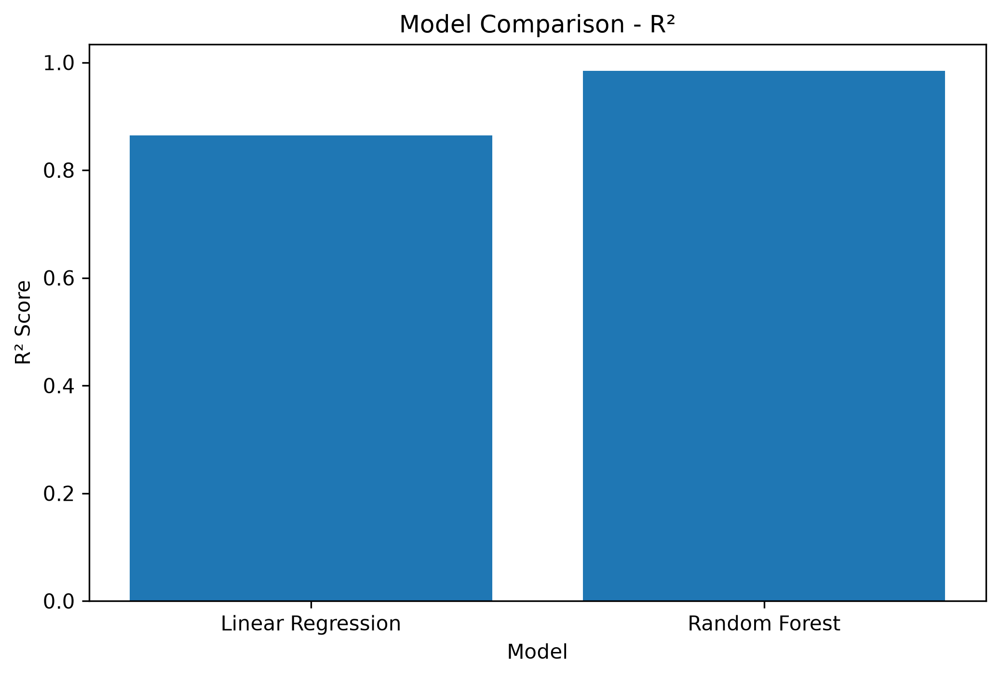
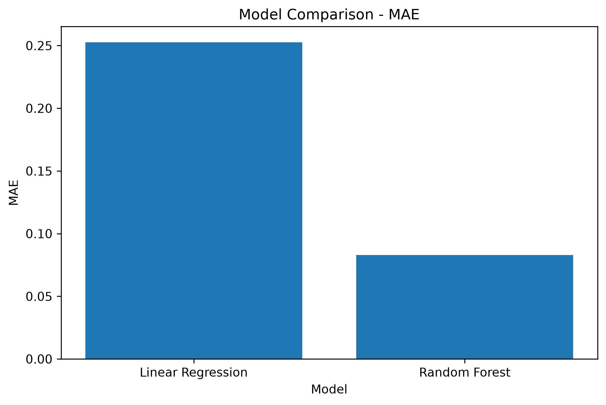
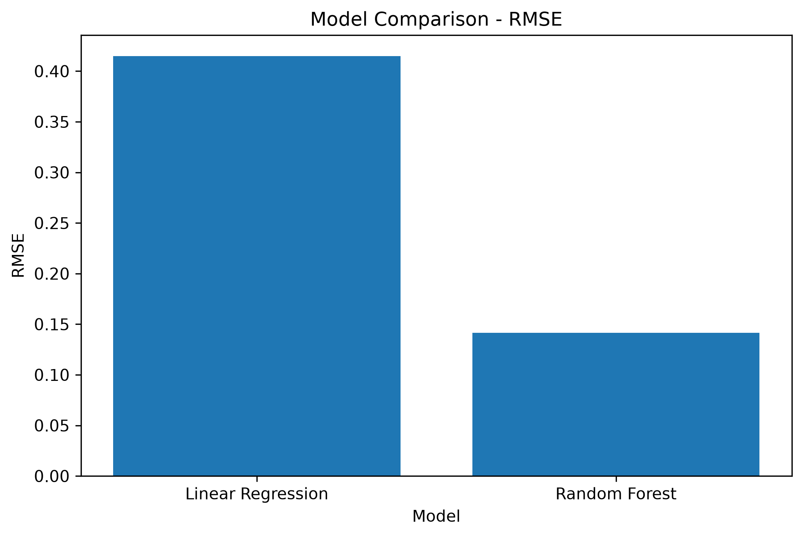
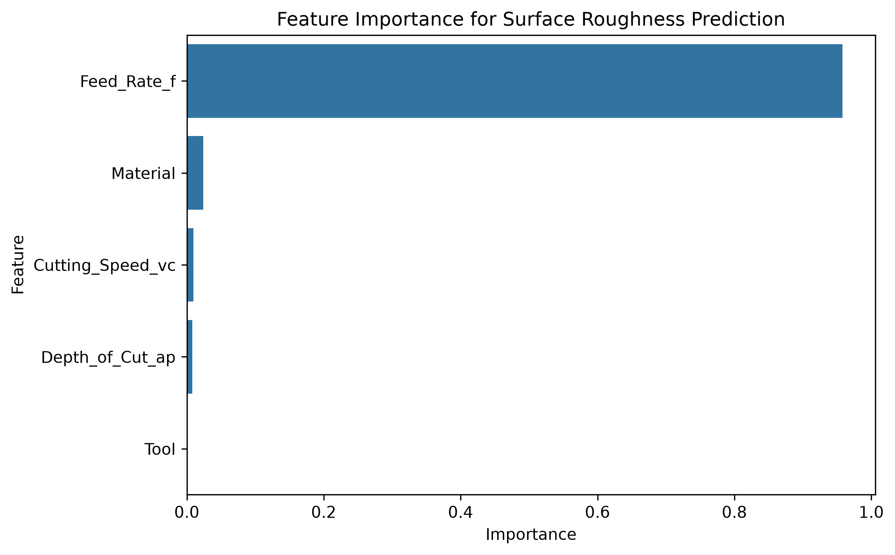

# CNC Machining Parameter Optimization Using Machine Learning


## Overview

This project focuses on predicting and optimizing CNC machining parameters using Machine Learning techniques.

The main objective is to develop a data-driven approach for predicting surface roughness and identifying optimal machining parameters to improve machining quality.

The project implements machine learning models to analyze the relationship between machining parameters and surface roughness.

---

# Objectives

- Predict CNC machining surface roughness using ML models
- Analyze the effect of machining parameters
- Identify the most influential machining factors
- Optimize machining parameters for better surface quality
- Generate automated analysis reports

---

# Project Workflow

```
Raw CNC Dataset
        |
        ↓
Data Preprocessing
        |
        ↓
Feature Engineering
        |
        ↓
Machine Learning Training
        |
        ↓
Model Evaluation
        |
        ↓
Feature Importance Analysis
        |
        ↓
Parameter Optimization
        |
        ↓
Final Report Generation
```

---

# Dataset Parameters

The model uses CNC machining parameters as input features.

## Input Features

| Feature | Description |
|---|---|
| Feed Rate | Material feeding speed |
| Cutting Speed | Spindle cutting speed |
| Depth of Cut | Cutting depth |
| Tool | Cutting tool type |
| Material | Workpiece material |

## Target Variable

```
Surface Roughness
```

---

# Machine Learning Models

Two regression models were developed:

## 1. Linear Regression

Used as a baseline model to understand the relationship between machining parameters and surface roughness.

## 2. Random Forest Regression

An ensemble machine learning model used for accurate prediction and parameter analysis.

---

---

## 📊 Model Performance Results

### R² Score Comparison



### MAE Comparison



### RMSE Comparison



## 🏆 Best Performing Model

### Random Forest Regression

Random Forest achieved the best performance among the tested models.

| Model | MAE | RMSE | R² Score |
|---|---|---|---|
| Linear Regression | 0.2525 | 0.4147 | 0.8646 |
| Random Forest | 0.0828 | 0.1416 | **0.9842** |

### Why Random Forest is Selected:

✅ Highest prediction accuracy  
✅ Lowest prediction error  
✅ Better capability to capture nonlinear machining relationships  

---
# Feature Importance Analysis

Feature importance analysis was performed to identify the contribution of each machining parameter.

## Feature Ranking

| Feature | Importance |
|---|---|
| Feed Rate | 95.80% |
| Material | 2.40% |
| Cutting Speed | 0.96% |
| Depth of Cut | 0.82% |
| Tool | 0% |

### Key Finding

Feed Rate is the most influential parameter affecting surface roughness.

---

# Optimization Result

The optimized machining parameters were generated using the trained machine learning model.

The optimization process helps identify machining conditions that can improve surface quality.

---

# Results Visualization

## Feature Importance




## Model Performance Comparison


---

# Project Structure

```
CNC-machining-parameter-optimization-ml

│
├── data
│   ├── raw
│   └── processed
│
├── notebooks
│
├── results
│   ├── figures
│   ├── metrics
│   └── report
│
├── src
│   ├── data_preprocessing.py
│   ├── train_model.py
│   ├── evaluate_model.py
│   ├── feature_analysis.py
│   ├── model_performance.py
│   ├── optimize_parameters.py
│   └── generate_report.py
│
├── requirements.txt
├── README.md
└── database.h5
```

---

# Installation

Clone the repository:

```bash
git clone https://github.com/asifahmedantor/CNC-machining-parameter-optimization-ml.git
```

Move into project directory:

```bash
cd CNC-machining-parameter-optimization-ml
```

Install dependencies:

```bash
pip install -r requirements.txt
```

---

# Running The Project

## 1. Data Preprocessing

```bash
python -m src.data_preprocessing
```

## 2. Train Machine Learning Models

```bash
python -m src.train_model
```

## 3. Evaluate Model

```bash
python -m src.evaluate_model
```

## 4. Feature Analysis

```bash
python -m src.feature_analysis
```

## 5. Model Performance Analysis

```bash
python -m src.model_performance
```

## 6. Parameter Optimization

```bash
python -m src.optimize_parameters
```

## 7. Generate Final Report

```bash
python -m src.generate_report
```

---

# Technologies Used

- Python
- Pandas
- NumPy
- Scikit-learn
- Matplotlib
- Machine Learning
- Random Forest Regression
- Linear Regression

---

# Results Summary

The developed ML pipeline successfully predicts CNC machining surface roughness and identifies important machining parameters.

Random Forest provided superior prediction performance compared with Linear Regression.

The analysis shows that Feed Rate has the strongest influence on surface roughness.

---

# Future Work

- Implement XGBoost and Neural Network models
- Develop real-time CNC optimization system
- Create web-based prediction application
- Integrate Industrial IoT monitoring
- Deploy ML model for industrial applications

---

# Author

**CNC Machining Parameter Optimization ML Project**

GitHub:
https://github.com/asifahmedantor/CNC-machining-parameter-optimization-ml